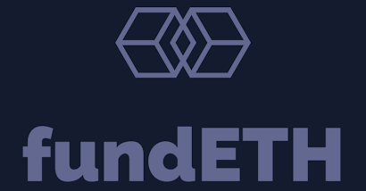

<a href=" ">
    
</a>

# fundETH

## Table of Contents
1. [Introduction](#one)
2. [Tech Stack](#two)
3. [Installation](#three)
4. [Resources](#four)

## <a name="one"></a>Introduction :smile:
#### Hello!! :wave:
fundETH is a next generation crowdfunding platform built on top of Ethereum to provide the safety of blockchains. <br/>
**Note:** Our smart contract is deployed on Polygon testnet Mumbai for now.
<br><br>
<!--Currently the website is deployed at https://fund-eth.vercel.app/<br>
(Note: Metamask is necessary for the site to function)
-->

## <a name="two"></a>Tech Stack :rocket:
- Polygon
    - For hosting the blockchain
- Next.js
    - For developing the frontend
- Solidity
    - For developing smart contracts
- Chakra UI
- Firebase
    - For authentication

## <a name="three"></a>Installation

To run the code on local device:

```cpp
cd <project_directory>
npm install
npm run dev
```
For compiling and hosting the smart contract on polygon test-chain:
Use the code in directory contracts/ and the following resource
https://docs.polygon.technology/docs/develop/alchemy/

## <a name="four"></a>Resources
https://medium.com/openberry/creating-a-simple-crowdfunding-dapp-with-ethereum-solidity-and-vue-js-69ddb8e132dd
